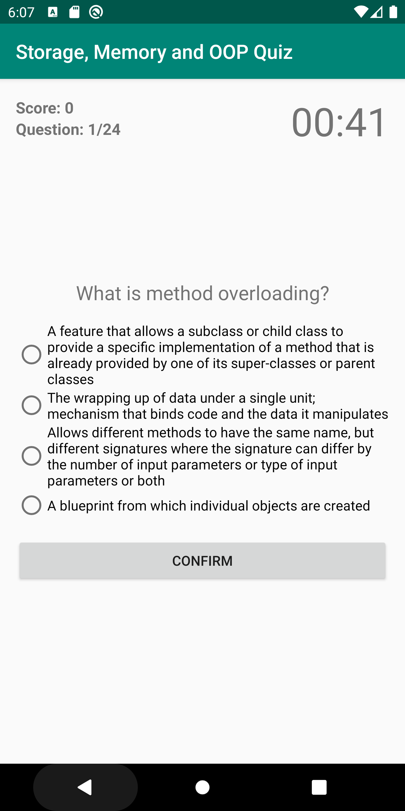
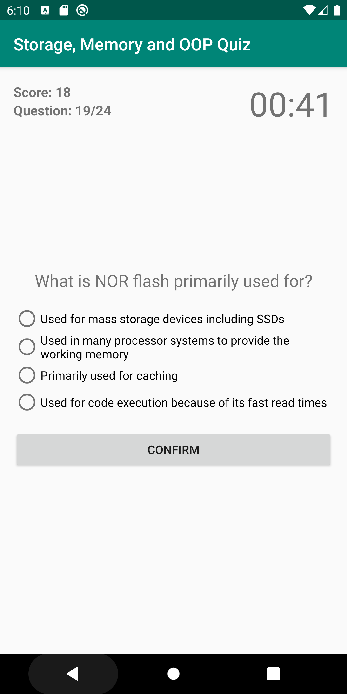

# AndroidStudyAppForOOP-Memory-Storage
A multiple choice quiz Android app built in Android Studio for personal use. Topics now include object-oriented programming, memory and other computer storage related items.

I'm still editing the app and in the process of getting approved by Google to put on Play Store.

# Next Steps:
Currently, I'm only using the app to test myself for possible interviews at the companies I would really like to work for. I intend to add different categorical questions and other features soon.

Screenshots so far:

